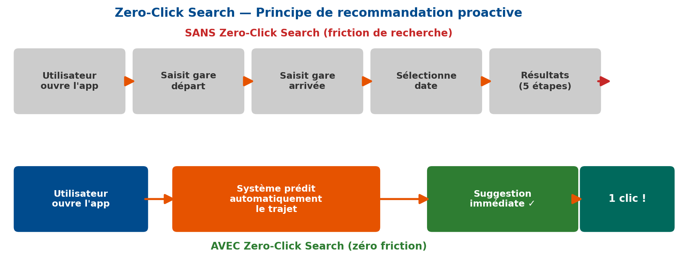
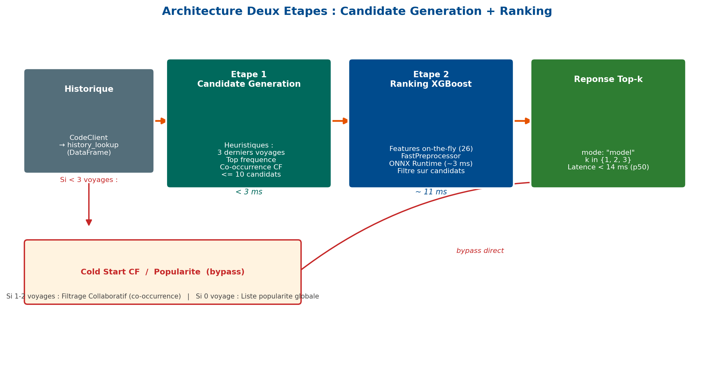
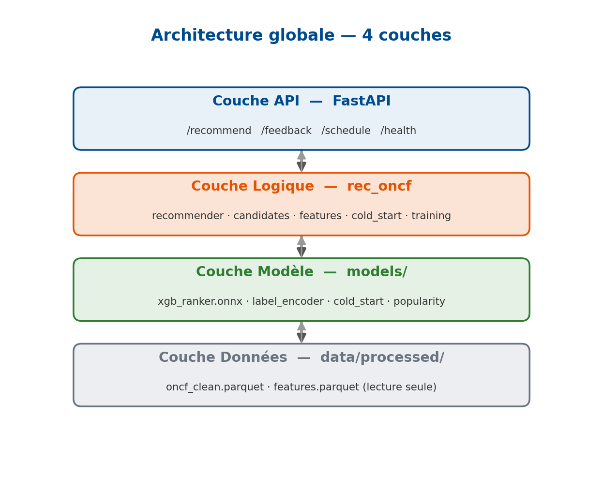

# ONCF Zero-Click Search Recommender


Proactive railway trip recommender for **ONCF** (Office National des Chemins de Fer du Maroc). Predicts the most likely next O/D pair (`LiaisonId`) for each client based on booking history and contextual signals, then exposes the top-1 / top-3 recommendations via a REST API.

> **Privacy:** complies with Loi 09-08 / CNDP (Morocco). `CodeClient` is the lookup key only — it is never used as a model feature and never appears in API logs.

<p align="center">
  
</p>

## Context

| | |
|---|---|
| **Type** | Projet de Fin d'Année (PFA) — Stage de 3 mois |
| **Organisme** | ONCF — Direction des Systèmes d'Information et Digital |
| **Formation** | Master IGOV (M1), Faculté des Sciences de Rabat, UM5 |
| **Période** | 16 mars — 16 juin 2026 |
| **Encadrante** | Mme Rania Basri |
| **Auteur** | Omar Chekroun |

---

## Key Results

- **HR@1 = 76.28%** — le modèle prédit le bon trajet du premier coup dans 3 cas sur 4
- **2.77x meilleur** que la baseline la plus forte (`most_frequent`)
- **Latence API < 14 ms** (p50) grâce à l'export ONNX Runtime
- **164/164 tests** passent (unit + integration + CI GitHub Actions)
- **Pipeline de réentraînement automatique** avec guardrail qualité et fenêtre glissante
- **Framework A/B testing** intégré pour valider les nouvelles versions du modèle
- **Cold-start handling** via filtrage collaboratif par co-occurrence
- **Conforme Loi 09-08 / CNDP** — CodeClient jamais utilisé comme feature

---

## Architecture

Two-stage **Candidate Generation + Ranking**, inspired by Uber Eats:

<p align="center">
  
</p>

1. **Candidate Generation** — heuristic on user history (last 50 trips, sorted by frequency then recency, top 10).
2. **Ranking** — XGBoost multiclass (1,011 classes) scores all classes; scores are then restricted to the candidate set before taking top-`k`.

Cold-start rule: clients with fewer than 3 historical bookings get collaborative filtering fallback via trip co-occurrence similarity.

<p align="center">
  
</p>

---

## Offline Metrics (Sprint 2 model)

| Metric | XGBoost | most_frequent | prev_liaison | global_top |
|---|---|---|---|---|
| Hit Rate @1 | **0.7628** | 0.2751 | 0.2620 | 0.0399 |
| Hit Rate @3 | **0.9055** | 0.5128 | 0.3204 | 0.1125 |
| MRR @3      | **0.8277** | 0.3865 | 0.2881 | 0.0707 |

Train rows: 393,344 — Test rows: 98,261 — Classes: 1,011 — Temporal split 80/20.

### Metrics by user history depth

| Segment (trips in train) | n | HR@1 | HR@3 | MRR@3 |
|---|---|---|---|---|
| 0–2 | 44,397 | 0.7393 | 0.8930 | 0.8091 |
| 3–5 | 16,780 | 0.7517 | 0.9038 | 0.8210 |
| 6–20 | 23,737 | 0.7786 | 0.9159 | 0.8411 |
| 21+ | 13,347 | **0.8268** | **0.9311** | **0.8741** |

---

## Tech Stack

| Layer | Technologies |
|---|---|
| **ML** | XGBoost, scikit-learn, ONNX Runtime, Pandas, NumPy |
| **API** | FastAPI, Pydantic, Uvicorn |
| **Infra** | Docker (multi-stage), Redis (caching), GitHub Actions CI |
| **Quality** | pytest (164 tests), Ruff (linter), temporal train/test split |

---

## Quick Start

```bash
# 1. Clone & install
git clone https://github.com/Chekroun2004/Rec_ONCF.git
cd Rec_ONCF
python -m venv .venv
source .venv/bin/activate       # Windows: .venv\Scripts\activate
pip install -e .

# 2. Run the offline pipeline
python scripts/01_make_dataset.py      # Raw CSVs -> clean parquet
python scripts/02_build_features.py    # Features engineering (25 cols)
python scripts/03_train_ranker.py      # XGBoost training (~43 min CPU)
python scripts/04_baselines.py         # Baseline comparison
python scripts/05_build_cold_start.py  # Collaborative filtering index
python scripts/06_export_onnx.py       # Export model to ONNX

# 3. Run tests
pytest tests/ -v                       # 164 tests

# 4. Start the API
uvicorn apps.api.main:app --reload
# -> http://127.0.0.1:8000/docs (Swagger UI)
```

### Docker

```bash
cd deploy
docker compose up --build
# -> http://localhost:8000/docs
```

---

## API

| Method | Route | Description |
|---|---|---|
| GET | `/health` | Liveness + model status |
| GET | `/models` | List all model variants (A/B testing) |
| POST | `/recommend` | Main endpoint — body below |
| GET | `/schedule/{liaison_id}` | Real-time ONCF train schedule |
| POST | `/feedback` | Click-through feedback logging |

**POST /recommend** body:
```json
{"code_client": "12345", "k": 3, "include_schedule": false}
```

Response:
```json
{
  "mode": "model",
  "variant": "d",
  "request_id": "a1b2c3d4-...",
  "recommendations": ["4512", "3801", "1122"],
  "labels": {"4512": "CASA VOYAGEURS → RABAT AGDAL"}
}
```

4 model variants available for A/B testing: `?variant=a|b|c|d`

---

## Repository Layout

```
src/rec_oncf/          Core library (importable as rec_oncf.*)
  cleaning.py          Raw CSV -> oncf_clean.parquet (business rules)
  features.py          Feature engineering (25 columns)
  candidates.py        Candidate Generation heuristic (top-10)
  training.py          XGBoost multiclass training + artifacts
  recommender.py       Two-stage recommender (Candidate + Ranking)
  cold_start.py        Collaborative filtering by trip co-occurrence
  retrain.py           Automated retraining pipeline with guardrails
  simulation.py        Daily retrain simulation framework
  popularity.py        Popularity-based fallback scores
  schedule.py          ONCF schedule scraping & enrichment
  metrics.py           HR@k, MRR@k evaluation
  config.py            Paths dataclass
  io.py                CSV / Parquet helpers

apps/api/main.py       FastAPI service (POST /recommend, GET /health)

scripts/               Numbered pipeline (01-12) + figure generators
  01_make_dataset.py     Data cleaning
  02_build_features.py   Feature engineering
  03_train_ranker.py     Model training
  04_baselines.py        Baseline comparison
  05_build_cold_start.py Cold-start index
  06_export_onnx.py      ONNX export
  07_retrain.py          Automated retraining
  08_build_popularity.py Popularity index
  09_train_challenger.py A/B challenger model
  10_promote_challenger.py Champion/challenger swap
  11_build_schedule_index.py Schedule enrichment
  12_simulate_daily_retrain.py Daily simulation

tests/                 164 unit + integration tests
configs/privacy.md     CNDP compliance notes
deploy/                Docker + docker-compose
.github/workflows/     CI (pytest + ruff lint)
```

---

## Documentation

- Architecture decisions: [`docs/superpowers/specs/`](docs/superpowers/specs/)
- Implementation plans: [`docs/superpowers/plans/`](docs/superpowers/plans/)
- Privacy & CNDP compliance: [`configs/privacy.md`](configs/privacy.md)

---

## Author

**Omar Chekroun** — Master IGOV (M1), Faculté des Sciences de Rabat, Université Mohammed V

[](https://www.linkedin.com/in/omar-chekroun/)
[](https://github.com/Chekroun2004)

## License

Internal academic project — UM5 Rabat / ONCF.
